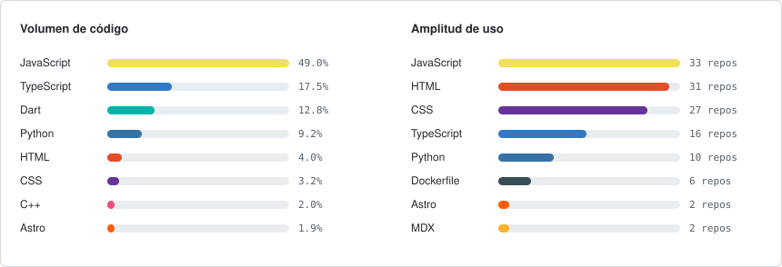

  
  

<h1 align="center">Harold G. S.</h1>

  <strong>Software Developer</strong>  ·  Full Stack  ·  Inteligencia Artificial  ·  Cloud  ·  Mobile

  Desarrollador de software enfocado en construir productos web, móviles y arquitecturas cloud, 
  con especial interés en la integración de IA generativa en sistemas reales.

  
  
  
  

---

## Perfil

Software Developer con experiencia en el desarrollo de aplicaciones web y móviles, trabajando
principalmente sobre el ecosistema **JavaScript / TypeScript** con React y Node.js. He diseñado e
implementado arquitecturas **cloud y serverless** sobre AWS, e integrado modelos de **IA generativa**
en flujos de soporte y automatización.

Mi trabajo abarca desde interfaces de usuario y APIs hasta desarrollo de videojuegos con Unity y
sistemas embebidos con Arduino e IoT.

| Área | Enfoque |
| :--- | :--- |
| Full Stack | Aplicaciones web con React, Next.js, Node.js y bases de datos SQL/NoSQL |
| Inteligencia Artificial | IA generativa, búsqueda semántica y automatización de procesos |
| Cloud y DevOps | Arquitecturas serverless en AWS, contenedores y CI/CD |
| Mobile | Aplicaciones multiplataforma con Flutter y desarrollo nativo Android |
| Game Dev e IoT | Videojuegos con Unity y C#, prototipos con Arduino y sensores |

---

## Tecnologías

**Frontend**

  

**JavaScript y TypeScript**

  

**Backend y Bases de Datos**

  

**Inteligencia Artificial y Visión por Computador**

  

**Cloud, DevOps y Herramientas**

  

**Mobile**

  

**Game Development e IoT**

  

**Entorno de Desarrollo**

  

---

## Proyectos Destacados

| Proyecto | Descripción | Stack principal |
| :--- | :--- | :--- |
| [ARIA](#aria--asistente-inteligente-para-sap) | Asistente con IA generativa para procesos SAP | AWS, Bedrock, Python, React |
| [Hecho en Sabaneta](#hecho-en-sabaneta) | Plataforma de comercio local con catálogo y carrito | TypeScript, Next.js, Firebase |
| [Arcoiris Zapatería](#arcoiris-zapatería-especializada) | Sitio de servicios para taller de restauración | TypeScript, Next.js, Firebase |
| [SENA Cloud](#sena-cloud) | Plataforma de gestión académica y administrativa | TypeScript, React, MongoDB |
| [Chaman Tarot Dashboard](#chaman-tarot-dashboard) | Dashboard con predicciones generadas por IA | React, Supabase, Make |
| [CashWin](#cashwin) | Videojuego multijugador de dados con pagos | Unity, C#, Photon PUN 2 |
| [SensoresAPP](#sensoresapp) | Sistema de alerta temprana ante inundaciones | Arduino, C++, IoT |
| [Farmacia Admin](#farmacia-admin) | Gestión de inventario y ventas para farmacias | React, JavaScript, MongoDB |

### ARIA — Asistente Inteligente para SAP

Sistema de asistencia basado en IA generativa para consultas y soporte sobre procesos SAP.

**Stack:** `AWS` `Lambda` `API Gateway` `Amazon Bedrock` `OpenSearch` `SAP` `Python` `React`

- Diseño de una arquitectura serverless escalable para gestionar solicitudes de tickets y respuestas automáticas.
- Integración de modelos de IA generativa con búsqueda en OpenSearch para entregar respuestas relevantes.
- Desarrollo de la interfaz web para usuarios finales y consultores SAP.
- Implementación de un flujo de escalamiento a consultor humano cuando la IA no resuelve el caso.
- Orientado a reducir tiempos de respuesta y mejorar la calidad del soporte.

### Hecho en Sabaneta

Plataforma de comercio local que reúne a los emprendimientos del municipio de Sabaneta en un
directorio con catálogo de productos, carrito de compras y publicación de eventos.

**Sitio:** [hechoensabaneta.com](https://hechoensabaneta.com) &nbsp;·&nbsp;
**Stack:** `TypeScript` `Next.js` `Firebase` `Google Cloud`

- Directorio de negocios organizado por categorías como gastronomía, tecnología y hogar.
- Catálogo de productos por emprendimiento con carrito de compras.
- Sección editorial para eventos y noticias del municipio.
- Registro autogestionado para que cada negocio publique su propio perfil.
- Backend sobre Firebase y despliegue en Google Cloud.

### Arcoiris Zapatería Especializada

Sitio web para un taller familiar de Medellín con cuarenta años de trayectoria, dedicado a la
reparación y restauración de calzado, bolsos y artículos de cuero.

**Sitio:** [arcoiriszapateria.com](https://arcoiriszapateria.com) &nbsp;·&nbsp;
**Stack:** `TypeScript` `Next.js` `Firebase` `Google Cloud`

- Catálogo de más de cincuenta servicios con guía, diagnóstico y materiales de cada oficio.
- Galería comparativa de antes y después con control deslizante sobre fotografías del taller.
- Diagnóstico guiado que orienta al cliente hasta una cotización por WhatsApp.
- Filtrado de trabajos por categoría e información de las dos sedes.
- Optimización para búsqueda local en el Valle de Aburrá.

### SENA Cloud

Aplicación web integral para la organización académica y administrativa, que permite a instructores,
administradores y superadministradores coordinar sus responsabilidades desde una única plataforma.

**Stack:** `TypeScript` `JavaScript` `React` `MongoDB` `Tailwind CSS`

- Sistema con múltiples niveles de usuario y control de permisos.
- Gestión centralizada de información académica y administrativa.
- Interfaz moderna y responsive.

### Chaman Tarot Dashboard

Dashboard para servicios de tarot que utiliza IA para generar predicciones personalizadas.

**Stack:** `React` `Supabase` `Make` `IA` `Automatización`

- Panel web para la gestión y el seguimiento de lecturas.
- Generación de predicciones personalizadas mediante IA.
- Automatización de procesos con Make y persistencia de datos en Supabase.

### CashWin

Videojuego multiplataforma basado en el juego tradicional de dados, con mecánicas de apuestas en tiempo real.

**Stack:** `Unity` `C#` `Photon PUN 2` `MercadoPago` `Multiplayer`

- Sistema multijugador en tiempo real mediante Photon PUN 2.
- Integración con MercadoPago para el procesamiento de pagos.
- Arquitectura orientada a partidas y eventos en tiempo real.

### SensoresAPP

Proyecto educativo desarrollado con Arduino para la prevención de inundaciones en comunidades cercanas.

**Stack:** `Arduino` `C++` `Sensores` `IoT`

- Monitoreo de niveles de agua mediante sensores.
- Detección de condiciones de riesgo y sistema de advertencia temprana.
- Enfoque en prevención y educación comunitaria.

### Farmacia Admin

Sistema privado de administración y gestión de bodega para farmacias.

**Stack:** `React` `JavaScript` `MongoDB`

- Gestión de inventario de medicamentos y control de stock.
- Registro de ventas y generación de reportes administrativos.
- Autenticación y panel de administración para uso interno.

---

## Estadísticas de GitHub

  

## Contribucion de GitHub

  

---

## Actualmente Explorando

- IA generativa y sus aplicaciones en producto.
- Arquitecturas serverless y servicios de AWS.
- Desarrollo full stack con TypeScript.
- Flutter y desarrollo móvil multiplataforma.
- Linux, ciberseguridad y prácticas DevOps.

---

## Contacto

  
  

  Gracias por visitar mi perfil.

