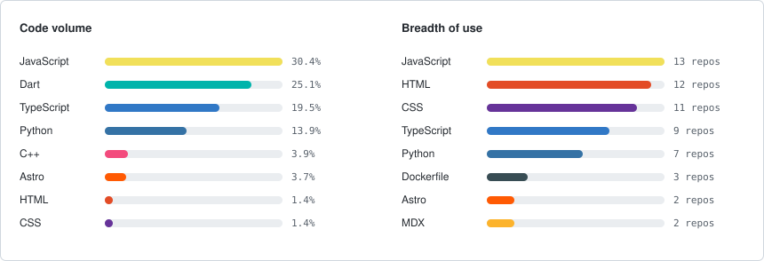

  
  

<h1 align="center">Harold G. S.</h1>

  <strong>Software Developer</strong> &nbsp;·&nbsp; Full Stack &nbsp;·&nbsp; Artificial Intelligence &nbsp;·&nbsp; Cloud &nbsp;·&nbsp; Mobile

  Software developer focused on building web and mobile products and cloud architectures, 
  with a particular interest in bringing generative AI into real-world systems.

  
  
  
  

---

## Profile

Software developer with experience building web and mobile applications, working mainly across the
**JavaScript / TypeScript** ecosystem with React and Node.js. I have designed and implemented
**cloud and serverless** architectures on AWS, and integrated **generative AI** models into support
and automation workflows.

My work ranges from user interfaces and APIs to game development with Unity and embedded systems
with Arduino and IoT.

| Area | Focus |
| :--- | :--- |
| Full Stack | Web applications with React, Next.js, Node.js and SQL/NoSQL databases |
| Artificial Intelligence | Generative AI, semantic search and process automation |
| Cloud and DevOps | Serverless architectures on AWS, containers and CI/CD |
| Mobile | Cross-platform applications with Flutter and native Android development |
| Game Dev and IoT | Games with Unity and C#, prototypes with Arduino and sensors |

---

## Technologies

**Frontend**

  

**JavaScript and TypeScript**

  

**Backend and Databases**

  

**Artificial Intelligence and Computer Vision**

  

**Cloud, DevOps and Tools**

  

**Mobile**

  

**Game Development and IoT**

  

**Development Environment**

  

---

## Featured Projects

| Project | Description | Main stack |
| :--- | :--- | :--- |
| [ARIA](#aria--intelligent-assistant-for-sap) | Generative AI assistant for SAP processes | AWS, Bedrock, Python, React |
| [Hecho en Sabaneta](#hecho-en-sabaneta) | Local commerce platform with catalog and cart | TypeScript, Next.js, Firebase |
| [Arcoiris Zapatería](#arcoiris-zapatería-especializada) | Service site for a leather restoration workshop | TypeScript, Next.js, Firebase |
| [SENA Cloud](#sena-cloud) | Academic and administrative management platform | TypeScript, React, MongoDB |
| [Chaman Tarot Dashboard](#chaman-tarot-dashboard) | Dashboard with AI-generated predictions | React, Supabase, Make |
| [CashWin](#cashwin) | Multiplayer dice game with payment integration | Unity, C#, Photon PUN 2 |
| [SensoresAPP](#sensoresapp) | Early warning system for floods | Arduino, C++, IoT |
| [Farmacia Admin](#farmacia-admin) | Inventory and sales management for pharmacies | React, JavaScript, MongoDB |

### ARIA — Intelligent Assistant for SAP

Support system powered by generative AI for queries and assistance on SAP processes.

**Stack:** `AWS` `Lambda` `API Gateway` `Amazon Bedrock` `OpenSearch` `SAP` `Python` `React`

- Designed a scalable serverless architecture to handle ticket requests and automated responses.
- Integrated generative AI models with OpenSearch retrieval to deliver relevant answers.
- Built the web interface for end users and SAP consultants.
- Implemented an escalation flow to a human consultant when the AI cannot resolve a case.
- Aimed at reducing response times and improving support quality.

### Hecho en Sabaneta

Local commerce platform that brings together the businesses of the municipality of Sabaneta into a
directory with a product catalog, shopping cart and event publishing.

**Site:** [hechoensabaneta.com](https://hechoensabaneta.com) &nbsp;·&nbsp;
**Stack:** `TypeScript` `Next.js` `Firebase` `Google Cloud`

- Business directory organized by categories such as food, technology and home goods.
- Product catalog per business with a shopping cart.
- Editorial section for local events and news.
- Self-service registration so each business can publish its own profile.
- Firebase backend with deployment on Google Cloud.

### Arcoiris Zapatería Especializada

Website for a family-run workshop in Medellín with forty years of experience, dedicated to the
repair and restoration of footwear, bags and leather goods.

**Site:** [arcoiriszapateria.com](https://arcoiriszapateria.com) &nbsp;·&nbsp;
**Stack:** `TypeScript` `Next.js` `Firebase` `Google Cloud`

- Catalog of more than fifty services, each with its guide, diagnosis and materials.
- Before-and-after gallery with a drag comparison slider over real workshop photographs.
- Guided diagnosis that leads the customer to a WhatsApp quote.
- Filtering of past work by category, plus information for both locations.
- Optimized for local search across the Aburrá Valley.

### SENA Cloud

Comprehensive web application for academic and administrative organization, allowing instructors,
administrators and superadministrators to coordinate their responsibilities from a single platform.

**Stack:** `TypeScript` `JavaScript` `React` `MongoDB` `Tailwind CSS`

- System with multiple user levels and permission control.
- Centralized management of academic and administrative information.
- Modern, responsive interface.

### Chaman Tarot Dashboard

Dashboard for tarot services that uses AI to generate personalized predictions.

**Stack:** `React` `Supabase` `Make` `AI` `Automation`

- Web panel for managing and tracking readings.
- Personalized prediction generation through AI.
- Process automation with Make and data persistence in Supabase.

### CashWin

Cross-platform game based on the traditional dice game, with real-time betting mechanics.

**Stack:** `Unity` `C#` `Photon PUN 2` `MercadoPago` `Multiplayer`

- Real-time multiplayer system using Photon PUN 2.
- MercadoPago integration for payment processing.
- Architecture built around matches and real-time events.

### SensoresAPP

Educational project built with Arduino for flood prevention in nearby communities.

**Stack:** `Arduino` `C++` `Sensors` `IoT`

- Water level monitoring through sensors.
- Risk condition detection and early warning system.
- Focused on prevention and community education.

### Farmacia Admin

Private administration and warehouse management system for pharmacies.

**Stack:** `React` `JavaScript` `MongoDB`

- Medication inventory management and stock control.
- Sales tracking and administrative reporting.
- Authentication and admin panel for internal use.

---

## GitHub Statistics

  

## GitHub Contributions

  

---

## Currently Exploring

- Generative AI and its applications in product work.
- Serverless architectures and AWS services.
- Full stack development with TypeScript.
- Flutter and cross-platform mobile development.
- Linux, cybersecurity and DevOps practices.

---

## Contact

  
  

  Thanks for visiting my profile.

